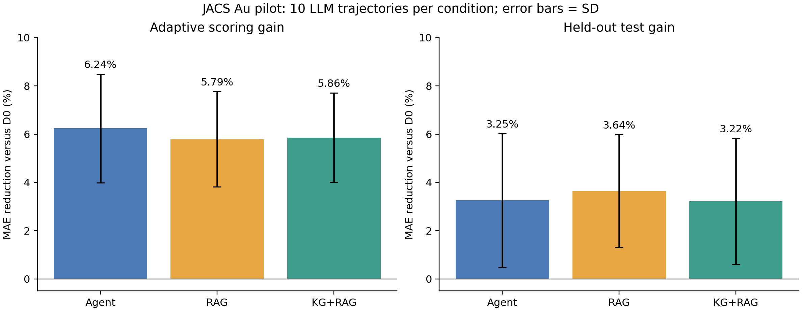
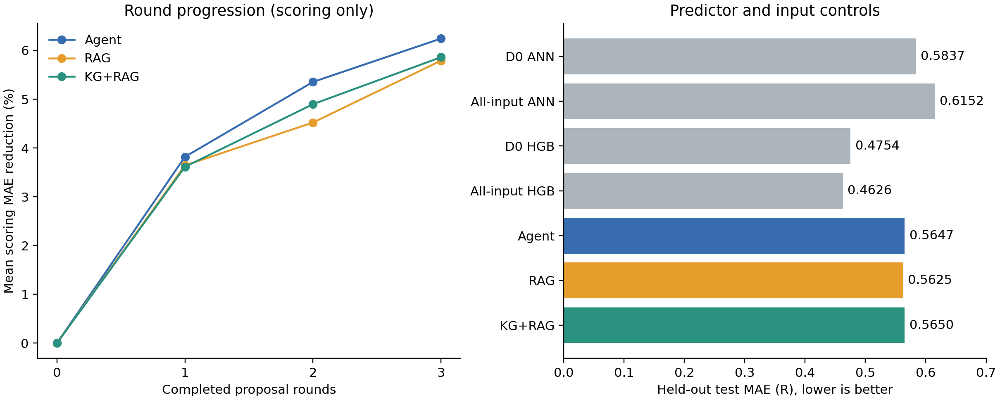

# JACS Au 原论文 D0：3×3 科学假设实验结果

核验时间：2026-09-29 11:40（北京时间）。**30/30 条轨迹完成，包括一次技术失败后的恢复。**

本轮表明：以原论文完整 D0 为基础，开放生成公式并逐轮筛选，能给固定 ANN 带来小幅预测收益。
KG+RAG 的额外优势尚未得到支持；科学机制、新颖性和跨体系泛化仍需验证。

## 1. 实际运行与核验

- 基线任务 `3812835`、证据冻结 `3826930`：完成。
- 主数组 `3827004`：29 项首次完成，RAG 第 2 条轨迹因第三轮没有返回恰好三个公式而失败。
- 恢复任务 `3827582`：完成，保留前两轮及已选公式，仅继续第三轮；原失败记录独立留存。
- 汇总任务 `3827005`：完成。主数组 10:08:09 开始，恢复于 11:19:57 结束，11:20:13 完成汇总。
- 从首条轨迹开始到汇总完成约 **72 分钟**；含失败尝试及恢复的平均 Slurm 分配时间约 **9.6 分钟/轨迹**。
- 使用 GLM-5.3-Flash，Agent、RAG、KG+RAG 各 10 条轨迹，每条 3 轮、每轮 3 个公式。
- 最终共 **270 个候选、257 个成功评分、13 个拒绝、66 次保留**。每轮至多保留一个，保留总数不是不同科学发现的数量。

分析脚本核对了全部 90 轮：每轮恰好三个候选、选取评分最优者、无改善保持原集合、评分单调不降、保留集合与最终记录一致。
从原 SI 标签及保存的预测数组重新计算了四项基线的评分/测试 MAE，与记录一致。没有重训或改变已完成轨迹的选择。

## 2. D0 与指标口径

**D0 为原论文完整 14 项描述符**：MW、LabuteASA、PBF、PMI1/2/3、SPAN、GeDi、Vol、density、ASA、AV、lsd_f、lsd_p。

ANN 沿用原论文结构与训练目标，4000 epochs；训练特征计算初始输出 bias 的统一修正用于所有新拟合。
训练集 2361 行，评分集 591 行，原论文独立测试集 738 行；评分用于三轮选择，测试仅在该轨迹结束后评价。
完整来源、初始化差异、数据排除规则见[实验协议](JACS_AU_NMI_PROTOCOL_20260928.md)。

主指标为吸附熵损失的 MAE，单位 R，越低越好。提升百分比 = `(基线 MAE − 最终 MAE)/基线 MAE × 100%`。

- 原作者公开权重复现：测试 MAE **0.5671029R**，对应论文约 0.57R。
- 新划分下的配对实验 D0：评分 **0.5756182R**，测试 **0.5837445R**。
- 本轮所有提升相对新实验 D0 计算。作者 checkpoint 的结果用于复现核验。

## 3. 三组主结果

均值±标准差来自同一划分、同一拟合种子上的 10 次 LLM 轨迹，描述生成波动，不能当成 10 个独立数据集上的显著性结果。

| 模式 | 评分提升 % | 独立测试提升 % | 平均测试 MAE / R | 测试提升为正 | 保留公式次数 |
| --- | --- | --- | --- | --- | --- |
| Agent | 6.24 ± 2.26 | 3.25 ± 2.77 | 0.564746 | 10/10 | 22 |
| RAG | 5.79 ± 1.97 | 3.64 ± 2.33 | 0.562491 | 9/10 | 21 |
| KG+RAG | 5.86 ± 1.84 | 3.22 ± 2.61 | 0.564961 | 9/10 | 23 |

测试平均值为 RAG > Agent > KG+RAG（按提升计）。RAG 与 KG+RAG 的差约 **0.42 个百分点**，远小于各组轨迹标准差；
本轮没有支持稳定的方法排序。三组平均测试收益均为正，共 **28/30 条**测试改善。
RAG 最差测试变化为 **−1.09%**，KG+RAG 为 **−0.025%**；负结果保留在统计中。

评分上全部轨迹均有改善，与逐轮保留最优集合的规则一致。独立测试没有用于选公式，因此仍可能出现负提升。



## 4. 三轮分别贡献了什么

| 模式 | 第 1 轮累计评分提升 % | 第 2 轮累计评分提升 % | 第 3 轮累计评分提升 % | 每轮保留次数（各最多 10） |
| --- | --- | --- | --- | --- |
| Agent | 3.82 | 5.35 | 6.24 | 10 / 6 / 6 |
| RAG | 3.64 | 4.52 | 5.79 | 10 / 5 / 6 |
| KG+RAG | 3.61 | 4.90 | 5.86 | 10 / 8 / 5 |

后两轮继续带来评分收益；并非每轮都需要增加一个公式。跨三组，第 1/2/3 轮分别保留 30/19/17 个。
本轮没有保存每轮的独立测试预测，不能据此断言三轮在泛化上优于一轮，也不能据此确定最优轮数。

## 5. 全输入与更强预测器对照

全输入包括 D0＋独立气相熵＋训练集拟合的分子类别 one-hot。未输入吸附标签、原预测、SHAP、分子名或框架名。

| 预测器/输入 | 评分 MAE / R | 独立测试 MAE / R |
| --- | --- | --- |
| D0 ANN | 0.575618 | 0.583745 |
| 全输入 ANN | 0.563663 | 0.615159 |
| D0 HGB（树模型） | 0.457184 | 0.475406 |
| 全输入 HGB | 0.446814 | **0.462592** |

全输入 ANN 在测试上比 D0 ANN 差，因此它是输入完整性的对照，不能称为本轮最强预测基线。
实际更强的对照是 HGB，且未做大规模调参。

将每条轨迹选定的公式再加入全输入 ANN，结果如下。这一步不根据测试重新筛选公式。

| 公式来源 | 全输入＋公式的平均测试 MAE / R | 相对全输入 ANN 的平均测试提升 % | 改善条数 |
| --- | --- | --- | --- |
| Agent | 0.592283 | 3.72 | 8/10 |
| RAG | 0.590977 | 3.93 | 9/10 |
| KG+RAG | 0.593706 | 3.49 | 9/10 |

三组的 D0＋公式 ANN，以及全输入＋公式 ANN，均 **0/30 条超过全输入 HGB**。
所以已观察到的收益与 ANN 的特征表达/训练有关，尚不能证明发现了超越强预测器的有效机制。
本轮尚未拟合 HGB＋所选公式；公式对树模型的额外收益有待验证。



## 6. 代表性公式与科学解释审查

代表轨迹按**最终评分提升**选择，测试仅如实报告，未按测试挑选或回滚。

| 模式 | 代表轨迹 | 评分提升 % | 测试提升 % | 最终保留数 |
| --- | --- | --- | --- | --- |
| Agent | 第 2 条 | 10.09 | 6.20 | 3 |
| RAG | 第 5 条 | 8.17 | 5.04 | 2 |
| KG+RAG | 第 7 条 | 8.61 | 4.87 | 2 |

下列是模型实际产生并保留的表达式，不是已经确认的新科学规律：

| 来源 | 部分保留表达式 | 当前审查结论 |
| --- | --- | --- |
| Agent #2 | `exp(-LabuteASA / maximum(lsd_f * lsd_p, 0.1)) * (density / maximum(ASA, 1.0))` | 表面/孔尺度耦合候选，密度单位与常数基准需核验 |
| Agent #2 | `log(maximum(Vol, 1.0) / maximum(MW, 1.0)) * (AV / maximum(lsd_f * LabuteASA * 1e-2, 1e-2))` | 原假设文本误将 Vol 解释为框架体积，机制表述需要纠正 |
| RAG #5 | `log(1 + (lsd_f - lsd_p) ** 2 / (PBF ** 2 + 1))` | 原假设文本误将 PBF 解释为分子最小尺寸 |
| RAG #5 | `log(1 + AV * density / (LabuteASA + 1))` | 可检验的容积/接触面积组合，但量纲和基准需说明 |
| KG+RAG #7 | `AV / (Vol * 1.0)` | 模型自报已有关系；AV 和 Vol 的单位不同，不能直接宣称无量纲比例 |
| KG+RAG #7 | `(ASA / (AV + 0.1)) / (LabuteASA / (Vol + 1.0) + 1.0)` | 表面与体积组合；不同量纲项及加性常数需逐项审查 |

原论文定义 PBF 为原子到最佳拟合平面的平均距离，用于描述平面性；Vol 为分子体积。
部分输出对这两项的含义有误，虽然表达式仍可数值计算，预测提升不能据此确认对应物理机制。[原论文第 4.2 节](https://pubs.acs.org/doi/abs/10.1021/jacsau.4c00429)

66 次保留的自报分类为：`known_relation` 7 次、`new_combination` 50 次、`uncertain` 9 次。
这些是 GLM 的分类，所有候选均 `novelty_verified=false`。既有论文关系的重新表达不能自动作为发现计数。
当前只检查了数值稳定性、冗余和 DSL 安全，没有完成量纲、变量语义、机制或文献新颖性的自动审查。

## 7. KG 为什么没有显示优势：可观察事实与待验证解释

- RAG 和 KG+RAG 都最多 10 条、4000 词法 token，但实际分别使用 **3964 与 3042 token**。最大预算一致，实际上下文长度未严格匹配。
- KG+RAG 最终上下文有 7 条 RAG、3 条 KG 证据；三条 KG 记录都具有三节点路径。
- KG 组 90 个候选中，仅 **6 个显式引用 KG 证据编号**；23 次保留中仅 **1 次显式引用 KG**。引用频率不能等同于实际因果贡献。
- 一条 KG 证据涉及拟合平移/转动熵，直接相关；另两条为一般微孔等温线描述和缺上下文的 FER 表格片段，提供机制的能力有限。
- RAG 自身包含 HTML/作者地址片段；纯硅吸附熵任务与一般含阳离子沸石/水体系证据之间的适用范围未逐条筛查。
- 提示词传递引文、路径 ID 和归一化概念，没有完整传递边语义、作用条件及可验证推理链；变量字典主要提供名称和单位。

这些事实提示应先改进科学语义和证据质量，再测试 KG 是否带来增益。
它们并不能单独证明本轮无优势的原因，也不能保证修正后 KG 一定最好。

## 8. 下一步建议（本次没有启动新实验）

1. **补完整的原论文变量字典与公式审查。** 固定含义、单位、适用范围、数值尺度；审查 PBF/Vol 混用、对有量纲量取对数、不同量纲相加和保护常数。保留本轮原始输出，另建审查版本。
2. **清理并审查科学证据。** 清除标题/地址/表格残片；核对温度、纯硅/含阳离子框架和物理机制的适用性；为 KG 提供带关系与条件的路径。新增无 KG、打乱 KG、检索长度匹配的消融。
3. **把公式放到强预测器与公平搜索对照上。** 比较 HGB＋公式、简单物理组合、随机/多项式组合和相同拟合预算的 AI 搜索；加入多拟合种子，排除新增输入维数、随机初始化及额外搜索预算导致的收益。
4. **进入新的分组泛化评估。** 预先冻结按分子/框架划分的测试，完成未见分子、未见框架外推；目前测试已用于结果分析，不能继续据其调方法并称为盲测。
5. **再研究轮数与完整工具链。** 预先规定 1/3/5 轮与等预算对照；multi-agent 用于提案、物理审查和反证，先验证它们能减少错误、改善外推。本轮结果不足以支持直接扩大轮数或宣称达到 NMI 主线目标。

## 9. 文件与复算

- 原始完成轨迹、证据、基线和失败尝试：[完整结果目录](../../research/reports/jacs_au_20260929/)。
- 原始自动汇总：[summary.json](../../research/reports/jacs_au_20260929/summary.json)。
- 核验与扩展分析：[analysis.json](../../research/reports/jacs_au_20260929/analysis.json)。
- 实际任务状态：[Slurm 记录](../../research/reports/jacs_au_job_status_20260929.txt)。
- 复算脚本：[analyze_jacs_au_complete.py](../../research/scripts/analyze_jacs_au_complete.py)。

```bash
python research/scripts/analyze_jacs_au_complete.py research/reports/jacs_au_20260929 \
  --jobs research/reports/jacs_au_job_status_20260929.txt \
  --data /path/to/Supporting_final_2 \
  --figures research/reports/jacs_au_20260929/figures
```

服务器结果目录保持为 `/public/home/xiaohe/lxf/catalysis-rag/runs/jacs-au-20260928`。
原失败记录、原始汇总与所有负提升保留；扩展分析没有修改评分、选择集合或测试结果。
