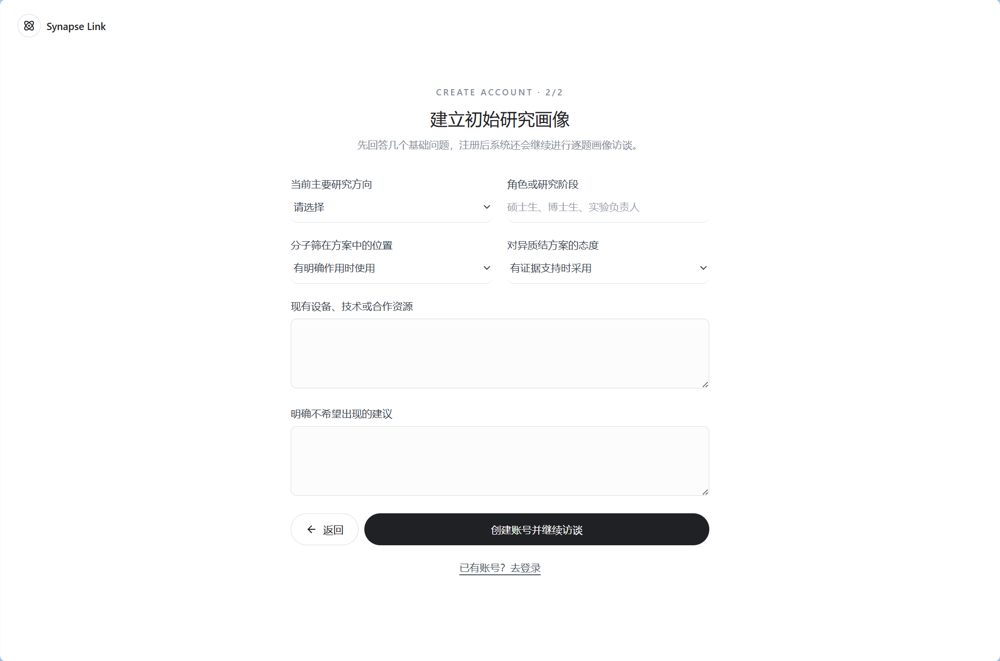
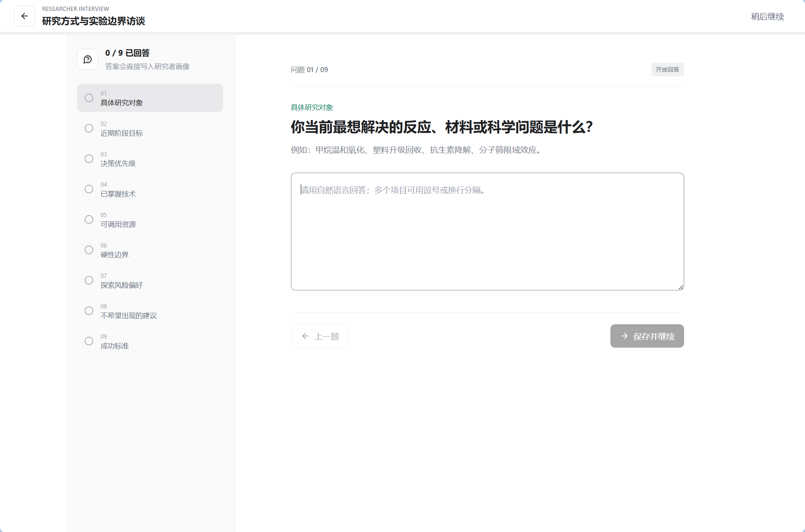
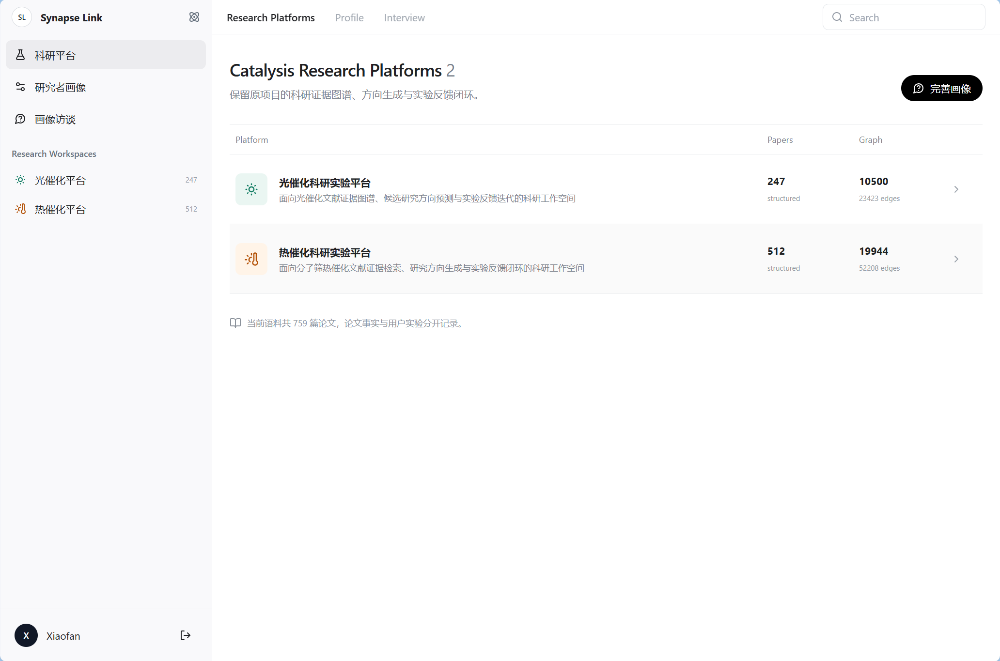
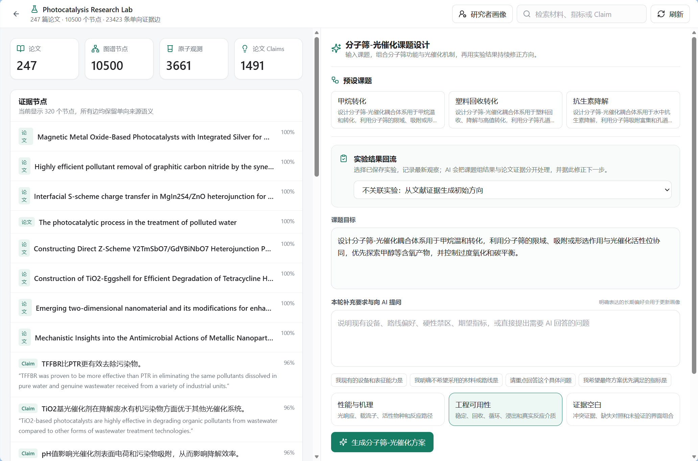
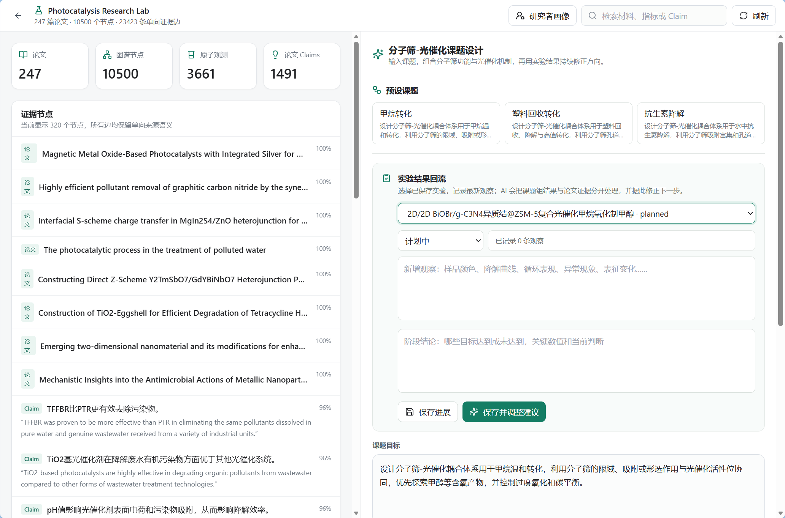

# 催化科研平台新手指南

本平台用于检索光催化、热催化论文证据，生成可验证的研究方向，并通过实验反馈持续完善建议和研究者画像。

访问地址：<http://39.104.48.214/>

## 1. 注册并建立初始画像

首次进入平台时，点击“还没有账号？立即注册”。

填写账号信息后，回答几个基础问题：

- 主要研究光催化、热催化，还是两者都做；
- 当前角色或研究阶段；
- 是否优先使用分子筛；
- 对异质结方案的态度；
- 已有设备、技术和合作资源；
- 明确不希望 AI 推荐的材料或路线。

这些信息会约束 AI 的方案排序，但不会改变论文原始事实。

## 2. 完成画像访谈

注册后会进入九题画像访谈，内容包括研究对象、近期目标、决策优先级、实验能力、资源、硬性限制、风险偏好和成功标准。

可以逐题保存，也可以点击“稍后继续”。之后可从左侧的“画像访谈”继续填写。

在“研究者画像”页面中可以随时修改信息，并查看或删除 AI 从对话中学习到的长期偏好。

## 3. 选择科研平台

平台提供两个研究工作空间：

- **光催化平台**：适合污染物降解、光解水、光驱动转化和光催化材料研究；
- **热催化平台**：适合分子筛、烃类转化、塑料升级回收、积碳与稳定性研究。

进入工作空间后，可以使用顶部搜索框检索材料、反应、性能指标或论文 Claim。

证据节点包括论文、实体、实验、观测和 Claim。点击或搜索节点时，应注意区分论文原文证据和系统归纳内容。

## 4. 生成研究建议

在“课题设计”区域：

1. 选择一个预设课题，或自行填写课题目标；
2. 在“本轮补充要求与向 AI 提问”中写明设备条件、路线偏好、禁区或具体问题；
3. 选择关注重点，例如性能与机理、工程可用性或证据空白；
4. 点击“生成方案”。

生成通常需要几十秒到数分钟，请保持页面打开，不要连续重复点击。

结果通常包括：

- 候选研究方向与可验证假设；
- 分子筛、活性相和界面设计；
- 支持证据及其边界；
- 可行性、风险和数据缺口；
- 最小验证实验和判断规则。

AI 只能引用当前知识图谱中能够定位的证据。没有直接证据的内容应视为待验证假设。

在“课题目标”中填写自己的课题，按需补充要求并选择关注重点，然后点击绿色生成按钮。

## 5. 记录实验并形成反馈闭环

得到建议后，可以保存实验计划或新建实验记录，填写材料、步骤、条件、观察和阶段性结论。

下一次生成建议时，选择对应的已保存实验，AI 会同时参考：

- 论文与知识图谱证据；
- 研究者画像和实验约束；
- 课题组自己的实验结果。

用户实验与论文事实会分开保存，不会把一次实验观察自动当成通用结论。

首次生成假设并保存实验后，可以在“实验结果回流”中选择该实验，结合湿实验观察继续提问和调整建议。

## 使用原则

请始终区分以下四类内容：

1. **论文直接证据**：可以定位到论文或证据节点；
2. **跨论文归纳**：系统根据多篇文献进行总结；
3. **AI 候选假设**：需要实验验证，不能直接作为结论；
4. **用户实验记录**：属于当前账号和课题组的私有数据。

遇到生成失败时，可以先刷新页面后重试一次。若长时间没有返回，请保留课题目标和报错信息，交由管理员检查服务状态。
